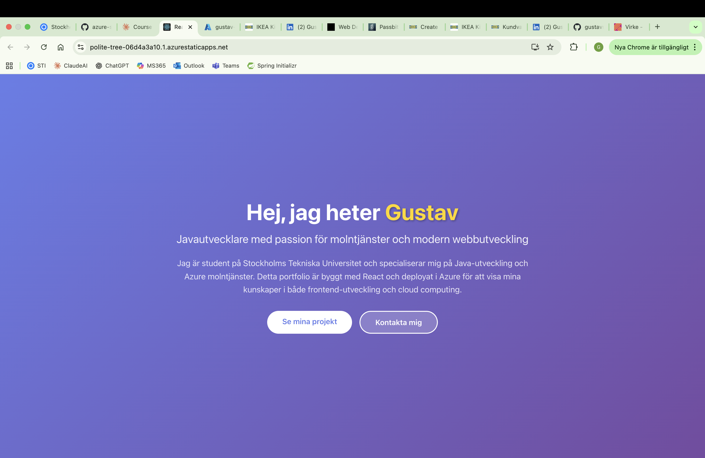
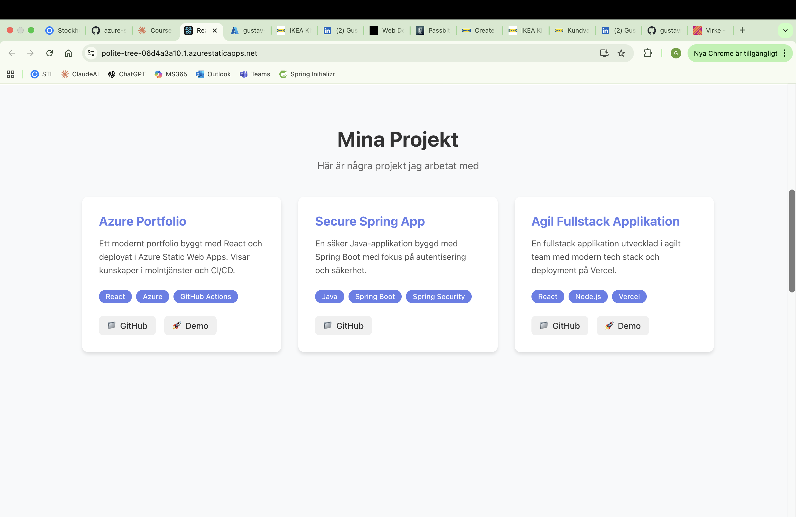
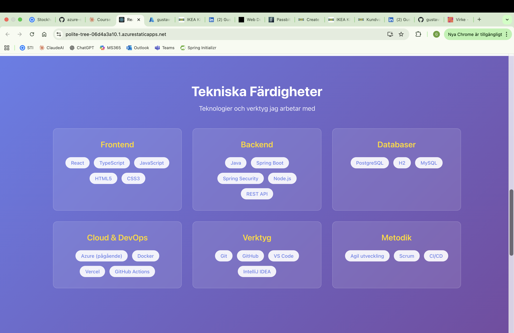
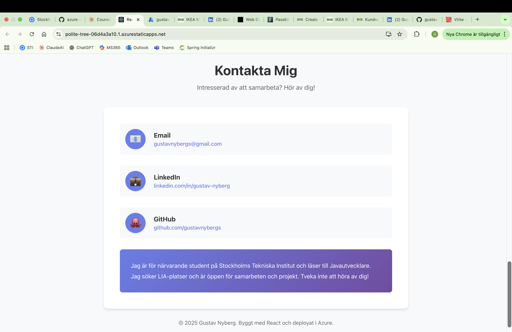
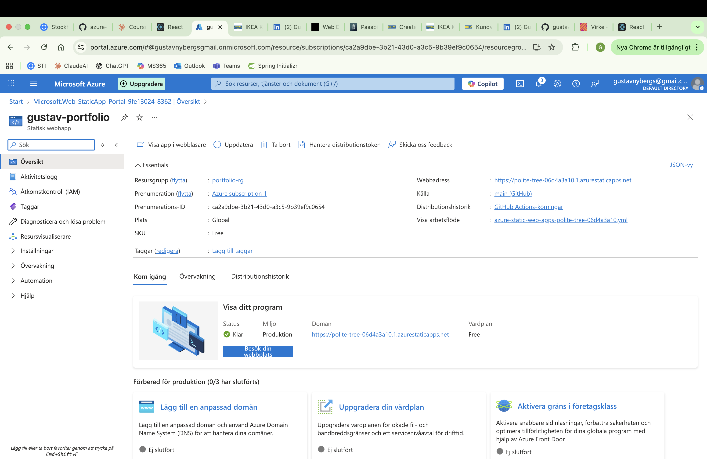
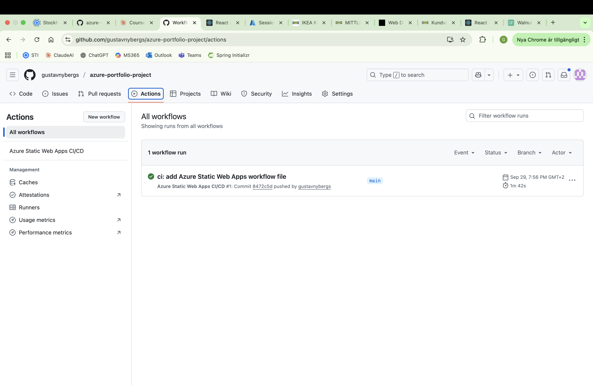
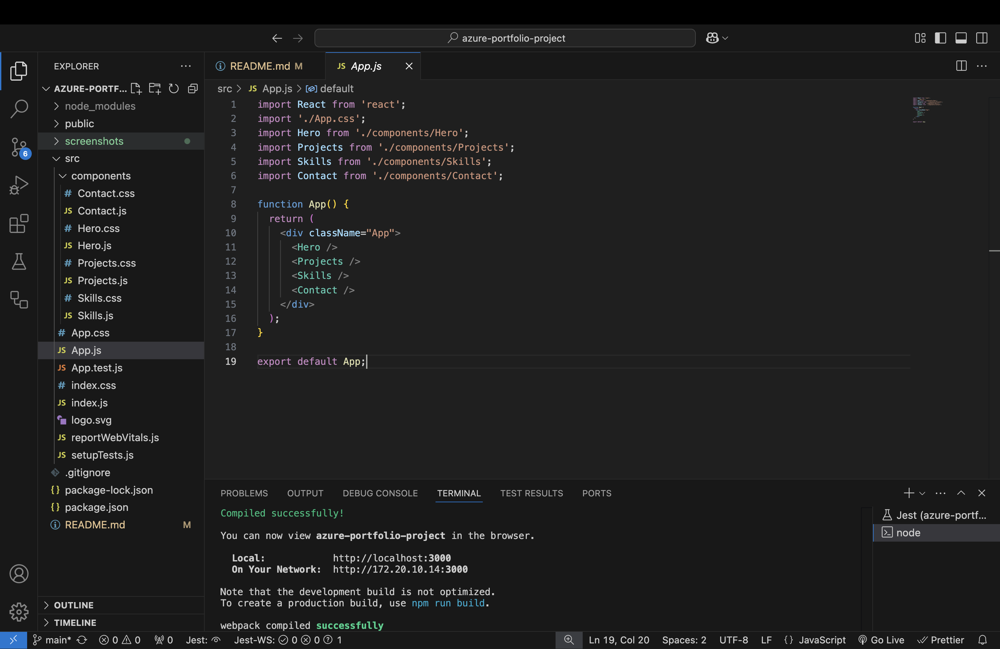

# Azure Portfolio Project

Ett modernt portfolio byggt med React och deployat i Microsoft Azure Static Web Apps. Detta projekt demonstrerar kunskaper inom frontend-utveckling, molntjänster och CI/CD.

## 🔗 Live Demo

**Deployed på Azure:** [https://polite-tree-06d4a3a10.1.azurestaticapps.net](https://polite-tree-06d4a3a10.1.azurestaticapps.net)

## 📋 Projektöversikt

Detta portfolio skapades som en del av kursen **Molntjänster** på Stockholms Tekniska Institut. Projektet visar färdigheter inom:

- React-utveckling med komponenter och hooks
- Azure Static Web Apps deployment
- GitHub Actions CI/CD pipeline
- Responsiv webbdesign
- Modern UI/UX

## 🛠️ Teknologier

- **Frontend:** React, JavaScript, HTML5, CSS3
- **Cloud Platform:** Microsoft Azure Static Web Apps
- **Version Control:** Git, GitHub
- **CI/CD:** GitHub Actions
- **Deployment:** Automatisk deployment via GitHub integration

## 📸 Screenshots

### Live Portfolio

#### Hero Section


#### Projects Section


#### Skills Section


#### Contact Section


### Azure Deployment


*Azure Static Web App resurs med deployment-status och live URL*

### GitHub Actions CI/CD


*Automatisk deployment via GitHub Actions workflow*

### Project Structure


*React-projektets komponentstruktur*

## 🚀 Deployment Process

### 1. Skapa React-applikation
```bash
npx create-react-app azure-portfolio-project
cd azure-portfolio-project
```

### 2. Utveckla komponenter
Skapade följande komponenter:
- `Hero.js` - Presentation och introduktion
- `Projects.js` - Projektportfölj med GitHub-länkar
- `Skills.js` - Tekniska färdigheter kategoriserade
- `Contact.js` - Kontaktinformation och sociala länkar

### 3. Versionshantering med Git och GitHub

Projektet versionshanteras med Git och hostas på GitHub, vilket möjliggör integration med Azure Static Web Apps för automatisk deployment.

### 4. Deploya till Azure Static Web Apps

Skapade en Azure Static Web App resurs via Azure Portal och kopplade den till GitHub-repot. Azure identifierade automatiskt att projektet är en React-applikation och konfigurerade build-processen därefter. Vid skapandet genererade Azure automatiskt en GitHub Actions workflow-fil som hanterar all CI/CD.

### 5. Automatisk CI/CD Pipeline

GitHub Actions workflow körs automatiskt vid varje push till main branch och hanterar hela deployment-processen från build till publicering. Detta ger en sömlös utvecklingsupplevelse där ändringar i koden automatiskt reflekteras på live-sajten inom några minuter.

## 📁 Projektstruktur

```
azure-portfolio-project/
├── public/
├── src/
│   ├── components/
│   │   ├── Hero.js
│   │   ├── Hero.css
│   │   ├── Projects.js
│   │   ├── Projects.css
│   │   ├── Skills.js
│   │   ├── Skills.css
│   │   ├── Contact.js
│   │   └── Contact.css
│   ├── App.js
│   ├── App.css
│   └── index.js
├── screenshots/
├── package.json
└── README.md
```

## 💡 Vad jag lärt mig

### Cloud Computing & Azure
- Skillnaden mellan IaaS, PaaS och SaaS
- Azure Static Web Apps och dess användningsområden
- Fördelar med molnbaserad infrastruktur (skalbarhet, kostnadseffektivitet)
- Azures prismodell och Free tier-möjligheter

### CI/CD med GitHub Actions
- Automatisk deployment vid code changes
- GitHub Actions workflow-konfiguration
- Integration mellan GitHub och Azure

### React & Frontend
- Komponentbaserad arkitektur
- Props och state management
- Responsiv design med CSS
- Modern UI/UX principer

## 🎯 Framtida förbättringar

- Lägga till custom domain
- Implementera darkmode
- Lägga till fler projekt när de blir klara
- Förbättra laddningstider med lazy loading
- Lägga till animationer och transitions

## 👨‍💻 Om mig

Jag är student på Stockholms Tekniska Institut och läser till Javautvecklare. Detta portfolio visar mina kunskaper inom både backend (Java, Spring Boot) och frontend (React, TypeScript) samt molntjänster med Azure.

## 📞 Kontakt

- **GitHub:** [gustavnybergs](https://github.com/gustavnybergs)
- **Email:** gustavnybergs@gmail.com
- **LinkedIn:** [Gustav Nyberg](https://www.linkedin.com/in/gustav-nyberg-310958382/)

## 📝 Licens

Detta projekt är skapat som en del av utbildningen på Yrkeshögskolan.

---

**Byggt med ❤️ och deployat i Azure**


## Docker och Azure App Services (VG BONUS - Försök)

### Vad som gjordes:

**1. Containerisering**
- Skapade Dockerfile med multi-stage build (Node.js för build, Nginx för serving)
- Byggde Docker image lokalt: `docker build -t azure-portfolio:latest .`
- Testade containern lokalt på port 8080 - fungerade perfekt
- Taggade imagen för Azure: `docker tag azure-portfolio:latest gustavportfolioacr.azurecr.io/azure-portfolio:latest`

**2. Azure Container Registry**
- Skapade Azure Container Registry (Basic tier)
- Aktiverade Admin-användare för autentisering
- Loggade in: `docker login gustavportfolioacr.azurecr.io`
- Pushade imagen: `docker push gustavportfolioacr.azurecr.io/azure-portfolio:latest`
- Verifierade att imagen finns i ACR

**3. Azure App Service**
- Skapade App Service med Linux och Container som publish-metod
- Konfigurerade att hämta image från ACR
- Basic B1 pricing tier (minimum för containers)

### Utmaningar och felsökning:

**Problem:** App Service kunde inte starta containern. Fick "Application Error" och loggarna visade endast Kudu (Azure's management service), inte portfolio-containern.

**Felsökningsförsök:**

1. **Hanterad Identitet (Managed Identity)**
   - Aktiverade System-assigned Managed Identity för App Service
   - Gav identiteten AcrPull-rollen i Container Registry via IAM
   - Resultat: Containern startade fortfarande inte

2. **Admin Credentials**
   - Bytte autentiseringsmetod till Admin Credentials i Deployment Center
   - Verifierade att användarnamn och lösenord från ACR användes
   - Resultat: Ingen förändring

3. **SCM-autentisering**
   - Aktiverade grundläggande SCM-publicering (var inaktiverat)
   - Detta krävs för Azure's deployment-system
   - Resultat: Fortfarande samma problem

4. **Container-konfiguration**
   - Verifierade image-namn: `azure-portfolio`
   - Verifierade tagg: `latest`
   - Verifierade registry: `gustavportfolioacr`
   - Resultat: Konfigurationen var korrekt men containern startade inte

5. **Multipla omstarter**
   - Startade om App Service flera gånger
   - Väntade 5-10 minuter mellan varje försök
   - Resultat: Ingen förändring

**Diagnostik:**
- Loggström visade bara Kudu-processer, aldrig nginx eller portfolio-containern
- Azure Portal visade 404 NotFoundAssetBlade-fel
- Inga felmeddelanden om image pull eller autentisering syntes i loggarna

**Möjliga orsaker:**
Detta tyder på att App Service inte ens försökte hämta containern från ACR, trots korrekt konfiguration. Möjliga orsaker kan vara:
- Nätverkskonfiguration eller firewall-regler mellan App Service och ACR
- Fördröjning i att behörigheter propagerar i Azure
- Bugg eller begränsning i Azure App Service för Linux med Basic B1 tier
- Port-konfigurationsproblem (Dockerfile exponerar port 80, men App Service kan förvänta sig annan port)

### Lärdomar:

Trots att containern inte kunde deployas framgångsrikt gav projektet värdefull erfarenhet av:
- Docker containerisering och multi-stage builds
- Azure Container Registry och image management
- Olika autentiseringsmetoder i Azure (Managed Identity vs Admin Credentials)
- Felsökning av molninfrastruktur och tolkning av loggar
- Förståelse för komplexiteten i Azure-tjänsters interaktion
- Skillnaden mellan Static Web Apps (PaaS) och App Services med containers (IaaS-liknande)

I produktion skulle nästa steg vara att kontakta Azure Support eller överväga alternativa deployment-metoder som Azure Container Instances eller Azure Kubernetes Service.